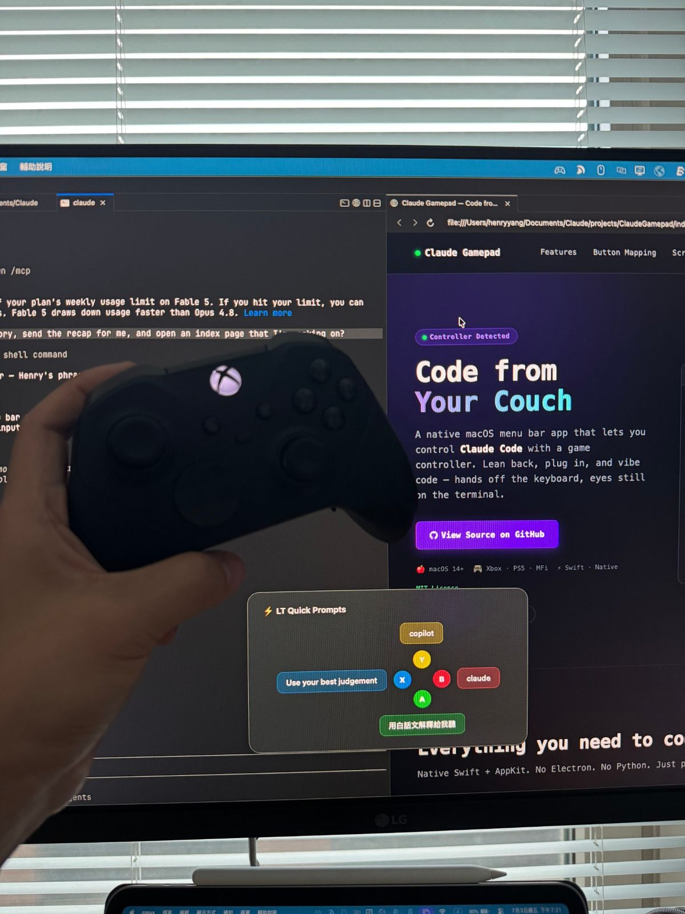

# Handoff — "The recent projects I'm doing" section

Branch: `claude/focused-feynman-ls50n9` · Written 2026-09-18

The section is **built and working** on `index.html`. This file lists what is
still missing, with exact paths and the markup to paste, so a local session can
finish it without re-deriving anything.

---

## What already ships

| Piece | State |
|---|---|
| Collapsed section at the bottom of the card | Done — native `<details>`, works with JS off |
| Two-column card grid (one column below 700px) | Done |
| Verb chip (one treatment for every role) + verb repeated in the title in cobalt | Done |
| Detail layer (modal) per project | Done — Esc / backdrop / close button, focus returns to the card |
| Workshop photos (3) | Done — `images/projects/workshop/` |
| Workshop YouTube, click-to-load player | Done — no request to Google until someone presses play |
| ClaudeGamepad photo (1) + copy | Done — `images/projects/claudegamepad/01-desk.jpg` |
| Deep link `index.html#p-workshop` / `#p-claudegamepad` | Done — opens the section and that project |
| `v2.css` cache buster | Bumped to `?v=3.3` in `index.html`, `story.html`, `og.html` |

Verified in Chromium at 1200px and 390px: open/close, Esc, focus return,
deep link, mobile reflow, zero console errors.

---

## What I need from you

### 1. ClaudeGamepad demo loop (the reason for this file)

**Do not commit the 100MB GIF, and do not commit the 80MB `.mov`.** GitHub
rejects any file over 100MB, warns over 50MB, and git history is permanent —
a big blob stays in every future clone even after it is deleted. This repo is
about 10MB today.

Convert the `.mov` on your Mac instead (the `.mov` is the better source; the
GIF is already a lossy re-encode):

```bash
cd ~/Downloads

# 10–15s muted loop for the page. Target: under 4 MB.
ffmpeg -i ClaudeGamePadDemo.mov -t 12 -vf "scale=960:-2,fps=24" \
  -an -c:v libx264 -crf 28 -preset slow -movflags +faststart \
  demo-loop.mp4

# poster frame, shown before the video loads and under prefers-reduced-motion
ffmpeg -i ClaudeGamePadDemo.mov -ss 3 -vframes 1 -vf scale=1200:-2 demo-cover.jpg

ls -lh demo-loop.mp4    # over 5 MB? raise -crf to 30, or drop -t to 8
```

Then:

```bash
mv ~/Downloads/demo-loop.mp4 ~/Downloads/demo-cover.jpg \
   images/projects/claudegamepad/
```

The markup is already in `index.html` as a comment inside the ClaudeGamepad
`.project__detail`, right after the Screens block — uncomment it:

```html
<div>
  <p class="pd__label">The demo</p>
  <video class="pd__loop" src="images/projects/claudegamepad/demo-loop.mp4"
         poster="images/projects/claudegamepad/demo-cover.jpg"
         autoplay muted loop playsinline preload="metadata"></video>
</div>
```

`.pd__loop` is already in `v2.css`, and `prefers-reduced-motion` is already
handled: when the visitor has asked their OS for less motion the script strips
`autoplay` and shows controls instead, so the poster sits still until they press
play. Verified in Chromium under both motion settings. Nothing to add.

If you would rather put the timelapse on YouTube like the workshop one, give me
the URL instead and I'll reuse the same click-to-load player — that costs the
repo nothing.

### 2. ClaudeGamepad — second screenshot (optional)

Right now there is one photo, shown full width. A second one (the menu bar
dropdown, or the button-mapping screen) would let it use the same 2-up strip as
the workshop. Drop it at `images/projects/claudegamepad/02-<name>.jpg`, long
edge 1600, JPEG q80.

### 3. ClaudeGamepad — video link (optional)

If there is a YouTube demo, the player block goes at the bottom of that
project's detail, same shape as the workshop's:

```html
<div>
  <p class="pd__label">The demo</p>
  <div class="pd__player" data-video="VIDEO_ID_HERE">
    
    <button class="pd__play" type="button" aria-label="Play the demo">
      <span><svg viewBox="0 0 24 24" width="30" height="30" aria-hidden="true"><path d="M9 6.5l9 5.5-9 5.5z" fill="currentColor"></path></svg></span>
    </button>
  </div>
  <p class="pd__caption"><a href="https://www.youtube.com/watch?v=VIDEO_ID_HERE" target="_blank" rel="noopener">Watch on YouTube &#8599;</a></p>
</div>
```

### 4. Workshop — a second line of description

The detail currently carries one line, your own slide subtitle:

> How to take notes that help you think — and connect ideas across every subject.

A second sentence on what people walked out with would round it off. Your words,
not mine. It goes as a second `<p>` inside `.pd__body`.

### 5. Workshop — a real poster frame (optional)

The player currently reuses `01-room.jpg` as its poster. A frame pulled from the
recording itself would look less like a repeat:

```bash
ffmpeg -i <the recording> -ss 12 -vframes 1 -vf scale=1600:-2 \
  images/projects/workshop/session-cover.jpg
```

Then point the player's `` at it.

---

## Decisions I made that you can overrule

- **Deep links are in.** `#p-workshop` opens the section and that project.
  Closing the modal strips the hash. Say so if you want it gone — it is one
  block in the script.
- **Section title is your original wording**, "The recent projects I'm doing".
- **Card cover images reuse the detail photos** rather than separate crops, to
  keep the page light. Total added weight so far: 756 KB for four photos.
- **QR and Now modals were left alone.** They do not return focus to their
  trigger on close, same as before this change. Worth fixing, but it was not
  part of this task.

## Adding the next engagement (RDB, or whatever comes)

Copy one `<article class="project">` block in `index.html`, change the `id` to
`p-<slug>`, swap the images, chip, title and copy. The card and its detail live
in the same block, so there is only one place to edit. `CLAUDE.md` has the same
note under "Projects section".

## Checking your work

No build step. Open `index.html` in a browser and check:
expand, both cards open, Esc closes, the page still reads at 390px wide, and
the video plays. If `v2.css` changes, bump `?v=` in all three HTML files.
